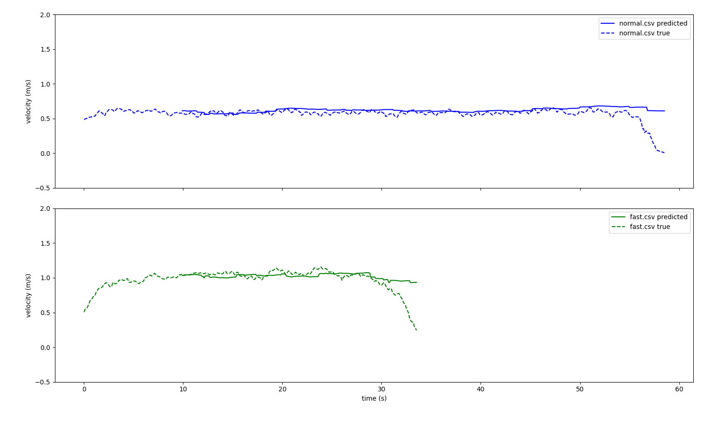

# Overview
The Smart Walker is an autonomous rehabilitation device used to help patients with dementia or other gait disabilities learn how to walk again. Our system is designed to be Assist as Needed (AAN) which means the user has full control of how the walker moves unless our system decides it needs intervene.

The current control system uses force torque sensors to measure conscious intent of the user during walking in order to walk with the patient without exerting much force to move the walker. While this is useful, having a control system that only looks at the force being applied to the handles isn’t an accurate depiction of the user's actual intent since it’s not taking into account the users legs. In order to fix this problem with relatively cheap components, I've added a feed forward + feedback control system using a 2D RPLidar A1M8-R6 to perceive the users legs and an AK-10-9 V2.0 motor with magnetic encoders to control the wheels. 

# Objectives
The objectives of this project: 

1. Design a control system that can measure the users intent through a 2D LiDAR scan of the patients legs in order to "walk" in rhythm with the user.
2. Extract gait metrics from sessions i.e (Velocity, Stride Length and Time Variability, Gait Symmetry, Lateral Step Length)
3. Execute Proof of Concept on different gait patterns.

# How It Works
It's difficult to create a real time control system that uses only 2D LiDAR scans due to the low 10 Hz sampling rate, occlusion, and noise from outside LiDAR scans. Because of this, traditional frequency calculation methods like a Fast Fourier Transforms (FFT) has built in latency proportional to it's window size, and resolution is also inversely proportional to the latency shown in the equations below. For a control system that needs to walk in rhythm with a patient that has irregular pacing i.e (changes in stride length and step timing) delay in motor control can cause discomfort and potential injuries when walking. 

In order to solve this I implemented an Hopf Adaptive Frequency Oscillator (AFO) that uses a coupled set of differential equations that react to every frame and converges to the frequency of any input signal over time. 

To make sure the input signal to the AFO doesn't have unpredictable noise and is filtered in real time I used a Kalman filter to predict the next data point. 

One caveat to the AFO is that it doesn't take into account how far the user is to the walker, so I also added a PD controller that takes the average distance of the users pelvis during calibration as the desired distance between the patient and walker. This ensures the walker to constantly be at a safe distance between itself and the patient by either accelerating or decelerating to keep in pace with the user. 

## Components

### Hopf Adaptive Frequency Oscillator (AFO) 

The Hopf Adaptive Frequency Oscillator is a coupled set of differential equations shown below that takes an outside input signal and tries to converge to the frequency of that signal. 

$$
\begin{aligned}
\ r     &= \sqrt{y^2 + x^2} \\
\dot{x} &= (\mu - r^2)x - y + \epsilon * F(t) \\
\dot{y} &= (\mu - r^2)y + x \\
\dot{\omega} &= \frac{\eta F(t) y}{r} \\
\omega  &= \dot{\omega} * dt + \omega
\end{aligned}
$$

> [!NOTE]
> Need to add animation, and explanation of what each gain does

### Scissor Metric
The input signal I chose was the difference in position of the left leg relative to the right. If we were to take the raw distance of each leg in terms of the walker we would have two different leg frequencies (Left and Right). This creates more complexity as we need to calculate when to use one leg frequency over the other and with a sampling rate of 10 Hz, it's common to miss heel strikes the moment they happen. In addition, this would create jittery and uncomfortable changes in velocity for the user. 

The scissor metric eliminates this by having an entire stride (Step length of Left and Right) in one oscillation, which embodies the overall frequency of the user. 

$$
\begin{aligned}
\ x_{signal} &= x_{left} - x_{right}
\end{aligned}
$$

> [!NOTE]
> Show Graph of Scissor metric vs regular Input Signal

### Kalman Filter

### Velocity Gain

### PD Controller (Feedback Velocity)
$$
\begin{aligned}
\ Velocity &= k (x_{signal} - x_{calibrated}) - \beta (\dot{x}) \\
\end{aligned}
$$

### Velocity Command

$$
\begin{aligned}
\ Velocity_{Feedback} &= k (x_{signal} - x_{calibrated}) - \beta (\dot{x}) \\
\ Velocity_{AFO} &= \omega * Sampling Frequency * Stride Length * Velocity Gain \\
\ Velocity &= Velocity_{AFO} + Velocity_{Feedback} \\
\end{aligned}
$$

# Simulation
In order to validate my approach and tune the gains on my AFO, I collected my own gait pattern data, which I used to calculate convergence of real frequency to my real time AFO calculation through an offline Fast Fourier Transform. In order to accurately simulate real time analysis I added expected hardware latency which is shown in the flow chart below. 

> [!NOTE]
> Data flow Latency

> [!NOTE]
> Convergence plots for fast and normal gait patterns (Need to add different gait patterns later)

# Functions

### Clustering & Filtering
* `scan_callback`: Returns LaserScan msg 
* `process_scan`: Returns x,y coordinates of laserscan values. 
* `cluster_find`: Identifies and returns centroids of clusters found.
* `kalman`: Predicts next centroid values based off of `cluster_find`

### Calibration
* `calibration`: Takes a specified window and interpolates the data between each stride to normalize each stride to be a 1x100 array. Calculates the standard deviation along axis = 0. Returns `True`, `average position`, and `velocity_gain` if `std_avg` < 0.5. 

### Velocity Calculation

### References

1. https://pubmed.ncbi.nlm.nih.gov/18728766/

